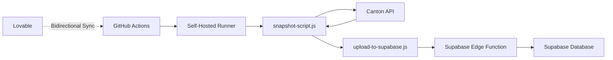

# GitHub Actions Setup for ACS Snapshots

This guide explains how to set up automated ACS snapshots using GitHub Actions with a self-hosted runner.

## Prerequisites

1. **Whitelisted IP**: You need a machine/server with a static IP that's whitelisted by Canton Network
2. **GitHub Account**: Access to create and manage GitHub Actions runners
3. **Supabase Credentials**: Your Supabase URL and anon key (already configured)

## Setup Steps

### 1. Connect Your Lovable Project to GitHub

1. In Lovable editor, click **GitHub** → **Connect to GitHub**
2. Authorize the Lovable GitHub App
3. Click **Create Repository** to generate a new repo with your code

Your code will now sync bidirectionally between Lovable and GitHub!

### 2. Set Up Self-Hosted Runner

On your machine/server with the whitelisted IP:

#### Linux/macOS:

```bash
# Navigate to your GitHub repository
# Go to Settings → Actions → Runners → New self-hosted runner

# Download the runner (GitHub will provide specific commands)
mkdir actions-runner && cd actions-runner
curl -o actions-runner-linux-x64-2.311.0.tar.gz -L https://github.com/actions/runner/releases/download/v2.311.0/actions-runner-linux-x64-2.311.0.tar.gz
tar xzf ./actions-runner-linux-x64-2.311.0.tar.gz

# Configure the runner
./config.sh --url https://github.com/YOUR_USERNAME/YOUR_REPO --token YOUR_TOKEN

# Install as a service (recommended)
sudo ./svc.sh install
sudo ./svc.sh start
```

#### Windows:

```powershell
# Download from GitHub Settings → Actions → Runners
# Extract and run:
.\config.cmd --url https://github.com/YOUR_USERNAME/YOUR_REPO --token YOUR_TOKEN
.\run.cmd
```

### 3. Add GitHub Secrets

In your GitHub repository:

1. Go to **Settings** → **Secrets and variables** → **Actions**
2. Add these secrets:
   - `SUPABASE_URL`: Your Supabase project URL
   - `SUPABASE_ANON_KEY`: Your Supabase anon key

### 4. Verify the Setup

The workflow is already committed to `.github/workflows/acs-snapshot.yml` and will:

- Run automatically every 3 hours (0, 3, 6, 9, 12, 15, 18, 21 UTC)
- Can be triggered manually from GitHub Actions tab
- Execute `snapshot-script.js` on your self-hosted runner
- Upload results to Supabase via `upload-to-supabase.js`
- Archive snapshots as GitHub artifacts (kept for 30 days)

### 5. Test It

Trigger the workflow manually:

1. Go to your GitHub repo → **Actions** tab
2. Click **ACS Snapshot** workflow
3. Click **Run workflow** → **Run workflow**
4. Monitor the logs to ensure it completes successfully
5. Check your Lovable app's Snapshots page to see the results!

## How It Works



1. **GitHub Actions** triggers on schedule or manual dispatch
2. **Self-hosted runner** (your machine with whitelisted IP) executes the job
3. **snapshot-script.js** fetches ACS data from Canton Network API
4. **upload-to-supabase.js** sends the snapshot to Supabase via edge function
5. **Supabase** stores the data in the database and storage
6. **Lovable** stays in sync with GitHub automatically

## Development Workflow

You can continue developing in Lovable:

1. Make changes in Lovable → Automatically syncs to GitHub
2. GitHub Actions runs on schedule using your whitelisted IP
3. Results populate your Supabase database
4. View snapshots in your Lovable app's Snapshots page

## Troubleshooting

### Runner Not Executing

- Verify runner status: `./svc.sh status` (Linux/macOS) or check Windows Services
- Check runner is online in GitHub Settings → Actions → Runners
- Ensure your IP is still whitelisted with Canton Network

### Snapshot Script Fails

- Check GitHub Actions logs for error messages
- Verify Canton API is accessible from your runner machine
- Test locally: `node snapshot-script.js`

### Upload Fails

- Verify `SUPABASE_URL` and `SUPABASE_ANON_KEY` secrets are set correctly
- Check Supabase edge function logs in your Lovable backend
- Test upload locally: `SUPABASE_URL=... SUPABASE_ANON_KEY=... node upload-to-supabase.js`

### Dependencies Not Installing

- Ensure Node.js 20+ is installed on your runner machine
- Run `npm install axios bignumber.js` manually on the runner

## Alternative: GitHub-Hosted Runner with Proxy

If you prefer not to maintain a self-hosted runner, you can:

1. Use a static IP proxy service (e.g., Quotaguard, Fixie)
2. Whitelist the proxy IP with Canton Network
3. Change workflow to `runs-on: ubuntu-latest`
4. Configure proxy in `snapshot-script.js`

## Cost Considerations

- **Self-hosted runner**: Free (you pay for your own compute)
- **GitHub-hosted runner**: Limited free minutes, then paid
- **Supabase**: Free tier includes generous limits
- **Storage**: GitHub artifacts (30 days retention, free for public repos)

## Need Help?

- Check Lovable Discord for community support
- Review GitHub Actions documentation: https://docs.github.com/en/actions
- Contact Canton Network support for IP whitelisting issues
